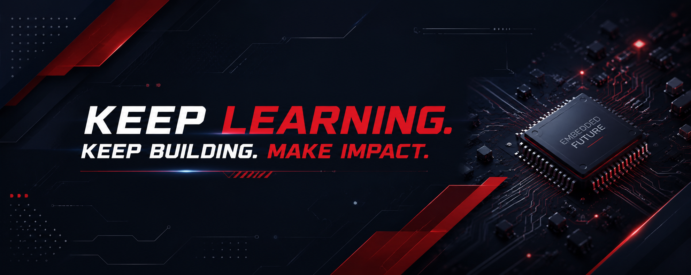

## About Me
I'm an Embedded Firmware Engineer passionate about building reliable firmware for MCU- and SoC-based embedded systems.

Currently:
- Developing firmware for CPE modules at FPT Telecom.
- Researching firmware for biomedical embedded systems integrating TinyML and lightweight cryptography at DESLab.

My work focuses on: `C/C++ firmware development` • `Kernel module development` • `TinyML` • `Secure IoT`

## Tech
- **Languages:** `C` • `C++`
- **Platforms:** `STM32` • `ESP32` • `Raspberry Pi`
- **Embedded Systems:** `Embedded Linux` • `FreeRTOS`
- **Development:** `Git` • `GNU Make` • `CMake`
