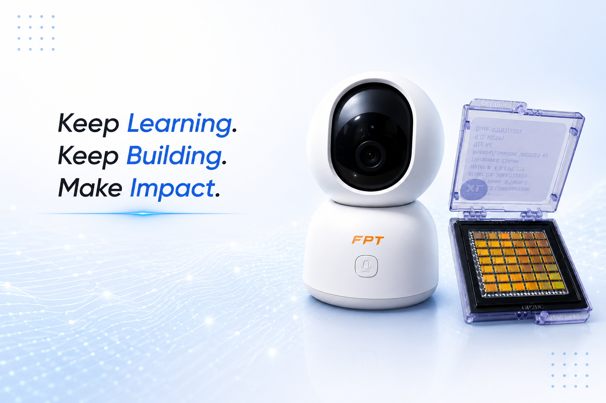

## About Me
I'm an **Embedded Software Engineering Student** passionate about building reliable firmware for MCU- and SoC-based systems.

**Currently:**
- **Embedded Software Intern at FPT Telecom:** Customizing HAL layers, API wrappers, and firmware modules for CPE & IP Camera products.
- **Undergraduate Researcher at DESLab (HCMUS):** Researching biomedical embedded firmware integrating TinyML & Lightweight Cryptography.

**Focus:** `C/C++ Firmware` • `HAL & Kernel Modules` • `TinyML` • `Secure IoT`

## Tech
- **Languages:** `C` • `C++`
- **Platforms:** `STM32` • `ESP32` • `Raspberry Pi`
- **Embedded Systems:** `Embedded Linux` • `FreeRTOS`
- **Development:** `Git` • `GNU Make` • `CMake`
